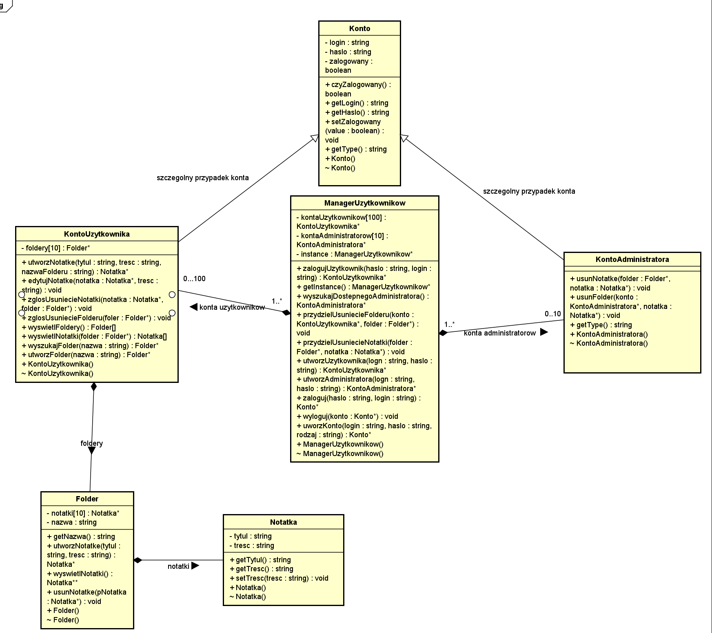

# NoteItDown: The C++ Note Management System

## Introduction

NoteItDown is an innovative note management application designed with UML and implemented efficiently using C++. Suitable for individual users as well as administrators, it offers a seamless note-keeping and management experience.



## System Architecture

The foundation of NoteItDown is a class hierarchy that starts with `UserAccount`, enabling fundamental user functionalities and note management through folders. The `AdministratorAccount` inherits from `UserAccount`, providing advanced capabilities for overseeing user activities and auditing system usage.

## Key Components

1. `UserAccount`: Secure access point for users, with methods to manage notes and personal folders.
2. `AdministratorAccount`: Specialized controls for system administrators, including user management and system-wide settings.
3. `Folder`: Organize and store your notes categorically for efficient retrieval and management.
4. `Note`: Representing the core of the application, this class enables users to create, edit, and store individual notes with ease.

## C++ Implementation

The application is developed using modern C++ principles, adhering to object-oriented best practices for maintainability and scalability. Each class and method reflects our UML's precision, ensuring a robust implementation.

```cmake
cmake_minimum_required(VERSION 3.26)
project(NoteItDown)

set(CMAKE_CXX_STANDARD 17)

add_executable(untitled main.cpp
        Folder.h
        Folder.cpp
        Notatka.h
        Notatka.cpp
        Konto.h
        Konto.cpp
        KontoUzytkownika.h
        KontoUzytkownika.cpp
        KontoAdministratora.h
        KontoAdministratora.cpp
        ManagerUzytkownikow.h
        ManagerUzytkownikow.cpp
)
```

## Getting Started

Clone the repo and explore a world where your notes are organized, your data is secure, and your administration is empowered.

## Contributing

Join our community of developers in enhancing NoteItDown. We welcome contributions that improve the codebase, add new features, or fix bugs.

## License

NoteItDown is released under the MIT License. Feel free to fork, modify, and distribute it as you see fit.

